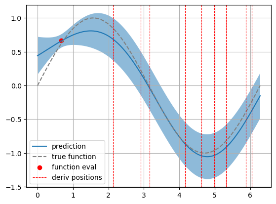

# JaxGP: Gaussian Process Regression in JAX

 1. [ Introduction ](#introduction)
 2. [ Installation ](#installation)
 3. [ Examples ](#examples)
 4. [ Notes ](#notes)

## Introduction
JaxGP is a Gaussian Process Regression framework based on [JAX](https://github.com/google/jax). 

The key difference to other GPR frameworks is the flexibility in choosing different datapoints for function and gradient observations. The idea behind this is to mainly use gradient observations and thereby formally integrate the gradient to recover the true function.

## Installation

Download the package from github via

```shell
git clone https://github.com/LukasEin/jaxgp.git
```

Then, to install the package directly, run

```shell
python3 setup.py install --user
```

or to install it in a conda environment run

```shell
conda create -n myenv python=3.8
conda activate myenv
python3 setup.py install
```

direcly in the newly created `jaxgp/` folder.

## Example usage

This is a quick example on how to use the present gaussian process regression framework to formally integrate gradient observations of a function. *(For more comprehensive examples see `1d_example_regression.ipynb` and `2d_example_regression.ipynb` in the `examples/` folder. To run the notebooks, the jaxgp module has to be installed first.)*

This example will show how to predict a 1D function using gradient information with a full GPR model. 

`jax.numpy` has almost the same usage as the standard `numpy` package, with the caveat that `jax.ndarray` is an immutable type, meaning that no inplace changes can be made. For creating training data this should however not be an issue.


```python
import jax.numpy as jnp
from jax import random
```

We will model a simple sin function, where the evaluation is noisy:


```python
# true function is a noisy lennard jones potential
def sin(x, noise=0.0, key = random.PRNGKey(0)):
    return jnp.sin(x) + random.normal(key,x.shape, dtype=jnp.float32)*noise

def cos(x, noise=0.0, key = random.PRNGKey(0)):
    return jnp.cos(x) + random.normal(key,x.shape, dtype=jnp.float32)*noise
```


To define the training data we first need to define boundaries to choose the datapoints from. Then, random points are chosen in this interval. `random.split` creates a new subkey from the previous key to get a new sudo-random sample from the uniform distribution.


```python
# Interval bounds from which to choose the data points
bounds = jnp.array([0.0, 2*jnp.pi])

# How many function and derivative observations should be chosen
num_f_vals = (1,)
num_d_vals = (10,)

# initial seed for the pseudo random key generation
seed = 0

# create new keys and randomly sample the above interval for training features
key, subkey = random.split(random.PRNGKey(seed))
x_func = random.uniform(subkey, num_f_vals, minval=bounds[0], maxval=bounds[1])
key, subkey = random.split(key)
x_der = random.uniform(subkey, num_d_vals, minval=bounds[0], maxval=bounds[1])

# noise with which to sample the training labels
noise = 0.1
key, subkey = random.split(key)
y_func = sin(x_func,noise, subkey)
key, subkey = random.split(key)
y_der = cos(x_der, noise, subkey)
```

The GPR framework needs as input for training a tuple of arrays `X_split` of which contains a set of points where the function is sampled and a set of points where the gradient is sampled. Both array in `X_split` is of shape `(n_samples_i, N)`. `X_split` should be ordered as follows: the first array represents the datapoints for the function observations and the second array represents the gradient of the function. `Y_train` should just be an array of shape `(n_samples_function + n_samples_gradient,)`.


```python
# reshaping needs to be done the get the arrays in the form (n_samples_i, N)
X_split = [x_func.reshape(-1,1),x_der.reshape(-1,1)]

Y_train = jnp.hstack((y_func, y_der))
```

### Defining the Kernel and its initial parameters

The kernels can be found in `jaxgp.kernels`. Currently implemented are `RBF`, `Linear`, and `Periodic` kernels. When in doubt what kernel to use, go with an `RBF` kernel.


```python
from jaxgp.kernels import RBF

kernel = RBF()
# an RBF kernel has per default 2 parameters
init_kernel_params = jnp.array([2.0, 2.0])
```

### Training the full GPR model

The regression models can be found in `jaxgp.regression`. The `ExactGPR` model takes as inital arguments a kernel to use, initial parameters for the kernel and a noise parameter that underlies the noisy datageneration.


```python
from jaxgp.regression import ExactGPR

model = ExactGPR(kernel, init_kernel_params, noise)
model.train(X_split, Y_train)
```

    OptStep(params=DeviceArray([0.92224514, 1.886944  ], dtype=float32), state=ScipyMinimizeInfo(fun_val=DeviceArray(-2.3065405, dtype=float32, weak_type=True), success=True, status=0, iter_num=13))


### Making predictions with the trained model

We will make predictions on an evenly spaced grid of 200 points in the above defined boundaries.


```python
predict_grid = jnp.linspace(*bounds, 200)

# model.eval returns a mean prediction and a confidence interval around the mean prediction
means, stds = model.eval(predict_grid.reshape(-1,1))
```

The prediction includes a mean prediction as well as a

### Visualizing the result


```python
import matplotlib.pyplot as plt

plt.plot(predict_grid, means, label="prediction")
plt.fill_between(predict_grid, means-stds, means+stds, alpha=0.5)

plt.plot(predict_grid, sin(predict_grid), c="gray", ls="--",label="true function")

plt.scatter(x_func, y_func, c="r", label="function eval")
for i,x in enumerate(x_der): 
    if i == 0:
        plt.axvline(x, c="r", lw=0.8, ls="--", label="deriv positions")
    else:
        plt.axvline(x, c="r", lw=0.8, ls="--")

plt.grid()
plt.legend()
```    


Plotting the predicted function together with its confidence interval we can see that even with only a few datapoints the prediction works good. The shaded region describes the $1\sigma$ confidence interval around the prediction.

## Notes

- Only the `eval` methods in the pure (non-combined) kernels need `asserts` for the shape. The gradients and "hessians" as well as any combined kernel `eval` methods call functions that already have asserts.

- Compare randomly sampled points, even grid, and bayes opt to see what works best

- check whats wrong with sparse code